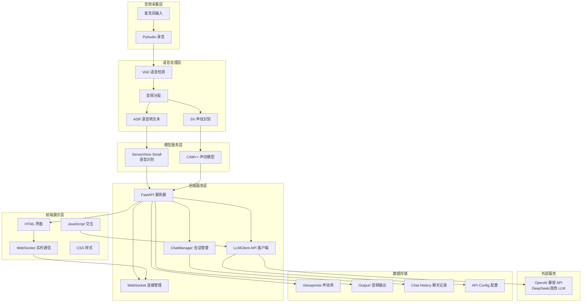

# AST 实时语音转文本与大模型分析系统

> 项目初始化时间: 2025-11-25

## 📖 项目概览

本项目是一个基于 Python 的实时语音转文本（ASR）与大模型分析系统，集成了语音识别、说话人识别（声纹）、语音活动检测（VAD）等技术，并提供 Web 界面支持实时交互。

### 🎯 核心功能

- **实时语音转文本（ASR）**: 基于 SenseVoice Small 模型，支持多语言识别
- **说话人识别**: 基于 CAM++ 模型，支持声纹库管理和实时说话人识别
- **语音活动检测（VAD）**: 基于 WebRTC VAD，准确检测语音片段
- **大模型对话**: 集成多种 LLM API（OpenAI 兼容），支持流式对话
- **Web 界面**: 响应式界面，支持实时显示转录结果和 LLM 对话
- **多会话管理**: 支持聊天历史、会话切换等功能

## 🏗️ 系统架构

### 架构总览 (Mermaid)



### 技术栈

| 类别 | 技术/框架 | 版本/说明 |
|------|-----------|-----------|
| **ASR 模型** | SenseVoice Small | FunASR |
| **声纹识别** | CAM++ | ModelScope |
| **VAD** | WebRTC VAD | webrtcvad |
| **音频处理** | librosa, soundfile, numpy | 音频加载/处理 |
| **录音** | PyAudio | 实时音频采集 |
| **Web 框架** | FastAPI | 后端 API 服务 |
| **前端** | HTML + JavaScript + CSS | 原生实现 |
| **LLM 客户端** | OpenAI Python SDK | 兼容多厂商 API |
| **配置管理** | JSON | 轻量级配置存储 |

## 📂 模块索引

### 核心模块

| 模块路径 | 类型 | 描述 | 关键功能 |
|----------|------|------|----------|
| **[main.py]** | 模块入口 | ASR 实时处理核心 | 语音转文本、声纹识别、VAD 检测 |
| **[server.py]** | Web 服务 | FastAPI 服务器 | WebSocket、REST API、线程管理 |
| **[llm_client.py]** | 客户端 | LLM API 集成 | 多厂商 API、流式响应 |
| **[chat_manager.py]** | 管理器 | 聊天会话管理 | 多会话、历史存储 |
| **[test_chat_api.py]** | 测试 | API 测试脚本 | 端点功能验证 |

### 前端资源

| 路径 | 类型 | 描述 |
|------|------|------|
| **[static/]** | 目录 | 前端静态资源 |
| **[static/index.html]** | UI 页面 | 主界面布局 |
| **[static/script.js]** | 脚本 | 前端交互逻辑 |
| **[static/style.css]** | 样式 | UI 样式定义 |

### 配置与数据

| 文件 | 类型 | 描述 |
|------|------|------|
| **[api_config.json]** | 配置 | LLM API 配置信息 |
| **[voiceprints/]** | 目录 | 声纹库（用户音频样本） |
| **[output/]** | 目录 | 临时音频文件输出 |
| **[chat_history.json]** | 数据 | 聊天会话历史记录 |

## 🚀 快速开始

### 环境依赖

```bash
# 核心依赖
pip install funasr modelscope webrtcvad pyaudio librosa soundfile numpy fastapi uvicorn websockets openai

# 可选：CUDA 支持（用于 GPU 加速）
# 确保已安装 CUDA 和 PyTorch
```

### 模型下载

系统会自动下载以下模型：
- **SenseVoiceSmall**: 约 200MB，用于语音识别
- **CAM++ 声纹模型**: 约 50MB，用于说话人识别

> 首次运行时会自动从 ModelScope/HuggingFace 下载

### 配置 LLM API

编辑 `api_config.json`:

```json
{
    "configs": [
        {
            "name": "your-model-name",
            "base_url": "https://api.your-provider.com/v1",
            "api_key": "your-api-key",
            "model": "your-model"
        }
    ],
    "current_config": "your-model-name"
}
```

### 运行方式

#### 1. 完整系统（推荐）

```bash
python server.py
```

访问 http://localhost:8000 查看 Web 界面

#### 2. 纯 ASR 模式

```bash
python main.py
```

控制台实时显示转录结果

#### 3. 测试 API

```bash
python test_chat_api.py
```

## ⚙️ 核心配置参数

### ASR 配置 (main.py)

| 参数 | 默认值 | 说明 |
|------|--------|------|
| `AUDIO_RATE` | 16000 | 音频采样率（Hz） |
| `AUDIO_CHANNELS` | 1 | 音频通道数（单声道） |
| `CHUNK` | 1024 | 音频块大小 |
| `VAD_MODE` | 3 | VAD 敏感度（0-3） |
| `SV_THRESHOLD` | 0.35 | 声纹识别阈值 |
| `OUTPUT_DIR` | "./output" | 音频输出目录 |
| `VOICEPRINT_DIR` | "./voiceprints" | 声纹库目录 |

### 服务器配置 (server.py)

| 参数 | 默认值 | 说明 |
|------|--------|------|
| `HOST` | "0.0.0.0" | 服务监听地址 |
| `PORT` | 8000 | 服务端口 |
| `CONFIG_FILE` | "api_config.json" | 配置文件路径 |

## 🔌 API 接口

### WebSocket 接口

#### `/ws` - ASR 实时数据推送

```javascript
// 接收消息格式
{
    "time": "14:30:25",
    "speaker": "张三 (置信度:0.85)",
    "text": "你好，这是一个测试消息"
}
```

#### `/ws/llm` - LLM 对话

```javascript
// 发送消息
{
    "messages": [
        {"role": "user", "content": "用户输入"}
    ],
    "chat_id": "uuid"
}

// 接收流式响应
{
    "type": "chunk",
    "content": "AI 回复片段"
}
```

### REST API

| 接口 | 方法 | 描述 |
|------|------|------|
| `/api/chats` | GET | 获取聊天列表 |
| `/api/chats` | POST | 创建新聊天 |
| `/api/chats/{id}` | GET | 获取聊天详情 |
| `/api/chats/{id}` | DELETE | 删除聊天 |
| `/api/chats/{id}/clear` | POST | 清空聊天 |
| `/api/config` | GET | 获取 LLM 配置 |
| `/api/config` | POST | 更新 LLM 配置 |

## 🔧 高级功能

### 声纹库管理

1. **添加说话人**:
   - 在 `voiceprints/` 目录放置 WAV 文件
   - 文件名即为说话人标识（如 `张三.wav`）
   - 支持 16kHz 单声道 WAV 格式

2. **识别逻辑**:
   - 自动加载所有 `.wav` 文件
   - 实时比对音频片段
   - 置信度超过阈值显示说话人信息

### LLM 对话功能

- **流式响应**: 实时显示 AI 回复
- **上下文记忆**: 自动保存聊天历史
- **多会话**: 支持多个独立对话
- **多模型**: 支持任意 OpenAI 兼容 API

## 📝 开发指南

### 添加新模型

1. **ASR 模型替换** (main.py:36-40):

```python
self.model_asr = AutoModel(
    model="your-new-model",
    trust_remote_code=True,
    device="cuda"  # 或 "cpu"
)
```

2. **声纹模型替换** (main.py:44-48):

```python
self.sv_pipeline = pipeline(
    task='speaker-verification',
    model='your-sv-model-id',
    model_revision='v1.0.0'
)
```

### 自定义前端界面

- 编辑 `static/index.html` 修改页面结构
- 编辑 `static/style.css` 调整样式
- 编辑 `static/script.js` 添加交互逻辑

### 扩展 API 功能

在 `server.py` 中添加新的端点：

```python
@app.post("/api/new-endpoint")
async def new_feature(data: dict = Body(...)):
    # 处理逻辑
    return {"status": "success"}
```

## 🐛 常见问题

### Q: 音频采样率不匹配错误

**A**: 系统会自动转换音频格式，无需手动处理。检查音频文件是否损坏。

### Q: LLM API 连接失败

**A**:
1. 验证 API Key 是否正确
2. 检查 Base URL 是否包含 `/v1` 后缀
3. 确认网络可以访问 API 服务

### Q: 声纹识别不准确

**A**:
1. 增加声纹库样本数量
2. 调整 `SV_THRESHOLD` 参数（降低提高敏感度）
3. 确保录制环境安静

### Q: 实时性延迟过高

**A**:
1. 使用 GPU 加速（设置 `device="cuda"`）
2. 降低音频质量（减少 `CHUNK` 大小）
3. 关闭详细日志输出

## 📄 日志与调试

### 日志输出位置

- **控制台**: 主要日志信息
- **浏览器控制台**: 前端调试信息
- **服务日志**: FastAPI 请求日志

### 关键日志关键词

- `[配置修正]`: Base URL 自动修正
- `[系统]`: LLM 客户端状态
- `[调试]`: 详细调试信息
- `[错误]`: 错误信息
- `[警告]`: 警告信息

## 📦 数据文件

### 运行时生成

| 文件 | 位置 | 说明 |
|------|------|------|
| `chat_history.json` | 根目录 | 聊天会话数据 |
| `temp_speech.wav` | output/ | 临时音频片段 |
| 模型缓存 | ~/.cache/ | FunASR/ModelScope 模型 |

### 持久化数据

- **声纹库**: `voiceprints/` 目录（需要备份）
- **聊天历史**: `chat_history.json`（建议备份）
- **API 配置**: `api_config.json`（建议备份）

## 📈 性能优化建议

1. **GPU 加速**: 确保 CUDA 可用，设置 `device="cuda"`
2. **模型量化**: 考虑使用量化版模型减小内存占用
3. **音频预处理**: 预加载模型到内存
4. **并发处理**: 使用多线程处理音频片段
5. **缓存策略**: 缓存模型权重和配置

## 🤝 贡献指南

1. Fork 本项目
2. 创建特性分支
3. 提交更改
4. 发起 Pull Request

## 📄 许可证

本项目基于 MIT 许可证开源。

## 🙏 致谢

- [FunASR](https://github.com/alibaba-damo-academy/FunASR) - ASR 框架
- [ModelScope](https://modelscope.cn/) - 多模态模型平台
- [WebRTC VAD](https://github.com/wangshub/webrtc-vad) - 语音活动检测
- [FastAPI](https://fastapi.tiangolo.com/) - 现代 Python Web 框架

---

> 💡 **提示**: 详细文档请参考各模块的 `CLAUDE.md` 文件
