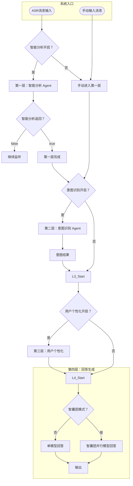
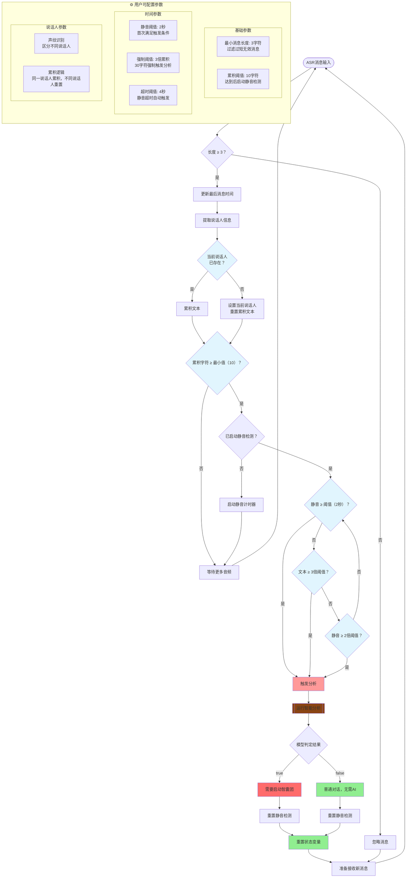
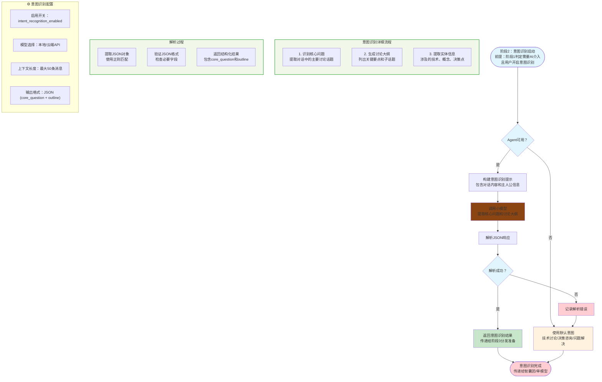

# 总流程
第一层是 智能分析或用户手动发送消息
第二层是 意图识别 
第三层是 用户个性化 
第四层是 智囊团或直接回答



## 智能分析流程


## 意图识别


## 智囊团
```mermaid
flowchart TD
    Start([阶段3：分发准备启动<br/>基于阶段1和阶段2结果]) --> LoadConfig[加载配置信息<br/>• API配置列表<br/>• 活跃模型列表<br/>• 角色配置]

    LoadConfig --> CheckMode{分发模式判断}

    subgraph DistributionLogic [分发逻辑]
        direction TB
        CheckThinkTank[检查智囊团模式<br/>是否配置多模型]
        LoadRoles[加载智囊团角色<br/>data/agent.json中的think_tank_roles]
        MatchRoles[根据角色标签匹配模型<br/>匹配config中的tags字段]
    end

    CheckMode -- 智囊团模式 --> DistributionLogic
    CheckMode -- 单模型模式 --> SingleModelPath[使用当前配置模型<br/>跳过角色匹配]

    DistributionLogic --> CheckMatches{找到匹配角色？}

    CheckMatches -- 是 --> ThinkTankMode[智囊团模式<br/>多模型并行处理<br/>每个角色独立分析]
    CheckMatches -- 否 --> DefaultSingleModel[回退到单模型模式<br/>使用当前激活模型]

    subgraph ThinkTankProcess [智囊团处理流程]
        direction TB
        Broadcast[广播到所有目标模型<br/>WebSocket消息：agent_triggered]
        ParallelAnalysis[并行调用多个LLM<br/>同时获取回答]
        CollectResponses[收集所有回答<br/>流式接收每个模型的输出]
        FormatResults[格式化结果<br/>为每个回答标注模型来源]
    end

    ThinkTankMode --> Broadcast
    Broadcast --> ParallelAnalysis
    ParallelAnalysis --> CollectResponses
    CollectResponses --> FormatResults

    subgraph SingleModelProcess [单模型处理流程]
        direction TB
        NotifyStart[发送开始通知<br/>"🤖 智能分析已启动"]
        CallModel[调用当前配置模型<br/>流式获取回答]
        SaveResponse[保存回答到聊天历史<br/>更新data/chat_history.json]
    end

    SingleModelPath --> SingleModelProcess
    DefaultSingleModel --> SingleModelProcess

    FormatResults --> Finalize[完成处理<br/>返回给前端UI]
    SaveResponse --> Finalize

    Finalize --> End([处理完成])

    %% 配置参数
    subgraph ThinkTankConfig [⚙️ 智囊团配置]
        direction TB
        Config1[multi_llm_active_names<br/>激活的模型名称列表]
        Config2[think_tank_roles<br/>智囊团角色配置<br/>角色ID、标签、描述]
        Config3[tags字段<br/>模型标签匹配<br/>如"技术专家"、"产品经理"等]
        Config4[当前配置<br/>current_config<br/>单模型模式使用]
    end

    %% 样式定义
    style Start fill:#e1f5fe
    style CheckMode fill:#e1f5fe
    style CheckMatches fill:#e1f5fe

    style ThinkTankMode fill:#fff3e0
    style DefaultSingleModel fill:#f3e5f5
    style SingleModelPath fill:#f3e5f5
    style End fill:#ffcdd2
    style Broadcast fill:#8B4513
    style ParallelAnalysis fill:#8B4513
    style CallModel fill:#8B4513

    style DistributionLogic fill:#f1f8e9,stroke:#4caf50,stroke-width:2px
    style ThinkTankProcess fill:#e8f5e8,stroke:#4caf50,stroke-width:2px
    style SingleModelProcess fill:#e8f5e8,stroke:#4caf50,stroke-width:2px
```

## 用户个性化(简历)
```
flowchart TD
    Start([用户入口：上传简历或开启简历解析模式]) --> CheckMode{是否开启简历模式？}

    CheckMode -- 否 --> NormalFlow[进入普通对话模式\n不加载简历画像]
    CheckMode -- 是 --> CheckCache{是否存在已解析的\nuser_profile.xml？}

    %% 缓存逻辑
    CheckCache -- 是 --> InjectXML[加载并注入\n已存在的用户画像 XML]
    CheckCache -- 否 --> ExtractPipeline[启动简历解析流程]

    %% 文本提取
    ExtractPipeline --> TextExtract[文本提取模块\nPyPDF2 / python-docx / OCR]
    TextExtract --> CallResumeAgent[调用 Resume Parsing Agent\n输入: TEXT_INPUT\n输出: 画像维度数据]

    %% 核心解析流程
    subgraph ResumeAnalysis [简历结构化画像构建流程]
        direction TB
        DimBasic[1. 基础画像抽取\n角色定位、年限、行业]
        DimCareer[2. 职业目标抽取\n岗位、行业、动机、成长方向]
        DimSkills[3. 核心技能抽取\n面试可推理的能力标签]
        DimExp[4. 工作经历提炼\n职责定位 + 关键成果]
        DimProjects[5. 项目结构化\n目标 / 角色 / 成果]
        DimTech[6. 技术栈提取\n保持原文技术词汇]
    end

    CallResumeAgent --> DimBasic
    DimBasic --> DimCareer
    DimCareer --> DimSkills
    DimSkills --> DimExp
    DimExp --> DimProjects
    DimProjects --> DimTech
    DimTech --> FormatXML[合并解析结果\n构建 XML 画像]

    %% 输出结构展示
    subgraph OutputFormat [XML 构建与持久化]
        direction TB
        XMLBasic[basic_info 节点]
        XMLCareer[career_target 节点]
        XMLSkills[core_skills 节点]
        XMLExp[experience_summary 节点]
        XMLProj[projects 节点]
        XMLTech[tech_stack_raw 节点]
        XMLGrowth[growth_plan 节点]
    end

    FormatXML --> XMLBasic
    XMLBasic --> SaveXML[持久化存储\nuser_profile.xml]

    SaveXML --> InjectXML

    %% 最终注入
    InjectXML --> End([完成：面试 Agent 可随时使用画像数据])

```