# 总流程
第一层是 智能分析或用户手动发送消息
第二层是 意图识别 
第三层是 用户个性化 
第四层是 智囊团或直接回答

```mermaid
flowchart TD

    %% --- 系统入口 ---
    subgraph Entrances [系统入口]
        ASR([ASR消息输入])
        Manual([手动输入消息])
    end

    %% 第一层入口：ASR自动触发 或 手动消息
    ASR --> SmartCheck{智能分析开启？}
    Manual --> L1_Manual[手动进入第一层]

    %% 第一层：智能分析（可关闭）
    SmartCheck -- 否 --> L1_Manual
    SmartCheck -- 是 --> SmartTrigger[第一层：智能分析 Agent]
    SmartTrigger --> SmartResult{智能分析返回？}

    SmartResult -- false --> ContinueListen[继续监听]
    SmartResult -- true --> L1_Out[第一层完成]

    L1_Manual --> IntentCheck
    L1_Out --> IntentCheck

    %% 第二层：意图识别（可关闭）
    IntentCheck{意图识别开启？} -->|否| L3_Start
    IntentCheck -->|是| IntentAgent[第二层：意图识别 Agent]
    IntentAgent --> L2_Out[意图结果]
    L2_Out --> L3_Start

    %% 第三层：用户个性化（可关闭）
    L3_Start --> PersonalCheck{用户个性化开启？}
    PersonalCheck -- 否 --> L4_Start
    PersonalCheck -- 是 --> Personal[第三层：用户个性化]
    Personal --> L4_Start

    %% 第四层：回答生成（必选）
    subgraph Answering [第四层：回答生成]
        L4_Start --> ModeCheck{智囊团模式？}

        ModeCheck -- 是 --> ThinkTank[智囊团并行模型回答]
        ModeCheck -- 否 --> SingleModel[单模型回答]

        ThinkTank --> Collect[输出]
        SingleModel --> Collect


    end

```



## 智能分析流程

```mermaid
flowchart TD
    Start([ASR消息输入]) --> CheckLen{长度 ≥ 3？}
    CheckLen -- 否 --> Ignore[忽略消息]
    CheckLen -- 是 --> UpdateTime[更新最后消息时间]

    UpdateTime --> ExtractSpeaker[提取说话人信息]
    ExtractSpeaker --> SameSpeaker{当前说话人<br/>已存在？}

    SameSpeaker -- 否 --> NewSpeaker[设置当前说话人<br/>重置累积文本]
    SameSpeaker -- 是 --> Accumulate[累积文本]

    Accumulate --> CheckThreshold{累积字符 ≥ 最小值（10）？}
    NewSpeaker --> CheckThreshold

    CheckThreshold -- 否 --> Wait[等待更多音频]
    CheckThreshold -- 是 --> StartSilence{已启动静音检测？}

    StartSilence -- 否 --> StartTimer[启动静音计时器]
    StartSilence -- 是 --> CheckSilence{静音 ≥ 阈值（2秒）？}

    StartTimer --> Wait
    CheckSilence -- 否 --> CheckForce{文本 ≥ 3倍阈值？}
    CheckSilence -- 是 --> Trigger[触发分析]

    CheckForce -- 是 --> Trigger
    CheckForce -- 否 --> CheckTimeout{静音 ≥ 2倍阈值？}

    CheckTimeout -- 是 --> Trigger
    CheckTimeout -- 否 --> CheckSilence

    Trigger --> RunAnalysis[[运行智能分析]]
    RunAnalysis --> CheckResult{模型判定结果}

    CheckResult -- true --> NeedsAI[需要启动智囊团]
    CheckResult -- false --> NoAI[普通对话，无需AI]

    NeedsAI --> Reset1[重置静音检测]
    NoAI --> Reset2[重置静音检测]

    Reset1 --> ResetSpeakerState[重置状态变量]
    Reset2 --> ResetSpeakerState
    ResetSpeakerState --> Ready[准备接收新消息]
    Ready --> Start

    Ignore --> Ready
    Wait --> Start

    %% 用户配置参数详细说明
    subgraph ConfigArea [⚙️ 用户可配置参数]
        direction TB
        subgraph Basic [基础参数]
            Config1["最小消息长度: 3字符<br/>过滤过短无效消息"]
            Config2["累积阈值: 10字符<br/>达到后启动静音检测"]
        end
        subgraph Timing [时间参数]
            Config3["静音阈值: 2秒<br/>首次满足触发条件"]
            Config4["强制阈值: 3倍累积<br/>30字符强制触发分析"]
            Config5["超时阈值: 4秒<br/>静音超时自动触发"]
        end
        subgraph Speaker [说话人参数]
            Config6["声纹识别<br/>区分不同说话人"]
            Config7["累积逻辑<br/>同一说话人累积，不同说话人重置"]
        end
    end

    style Trigger fill:#ff9999
    style RunAnalysis fill:#8B4513
    style NeedsAI fill:#FF6B6B
    style NoAI fill:#90EE90
    style ResetSpeakerState fill:#90EE90
    style CheckThreshold fill:#e1f5fe
    style CheckSilence fill:#e1f5fe
    style CheckForce fill:#e1f5fe
    style CheckTimeout fill:#e1f5fe
    style SameSpeaker fill:#e1f5fe
```


## 意图识别

```mermaid
flowchart TD
    Start([阶段2：意图识别启动<br/>前提：阶段1判定需要AI介入<br/>且用户开启意图识别]) --> CheckAgent{Agent可用？}

    CheckAgent -- 否 --> Fallback[使用默认意图<br/>技术讨论/决策咨询/问题解决]
    CheckAgent -- 是 --> BuildIntentPrompt[构建意图识别提示<br/>包含对话内容和主人公信息]

    BuildIntentPrompt --> CallIntentModel[调用小模型<br/>提取核心问题和讨论大纲]

    subgraph IntentDetails [意图识别详细流程]
        direction TB
        ExtractCore[1. 识别核心问题<br/>提取对话中的主要讨论话题]
        ExtractOutline[2. 生成讨论大纲<br/>列出关键要点和子话题]
        ExtractEntities[3. 提取实体信息<br/>涉及的技术、概念、决策点]
    end

    CallIntentModel --> ParseIntentJSON[解析JSON响应]

    subgraph ParseProcess [解析过程]
        direction TB
        ExtractJSON[提取JSON对象<br/>使用正则匹配]
        ValidateJSON[验证JSON格式<br/>检查必要字段]
        ReturnResult[返回结构化结果<br/>包含core_question和outline]
    end

    ParseIntentJSON --> Success{解析成功？}
    Success -- 是 --> ReturnIntent[返回意图识别结果<br/>传递给阶段3分发准备]
    Success -- 否 --> LogError[记录解析错误]

    ReturnIntent --> End([意图识别完成<br/>传递给智囊团/单模型])
    LogError --> Fallback
    Fallback --> End

    %% 配置参数
    subgraph IntentConfig [⚙️ 意图识别配置]
        direction LR
        Config1["启用开关：intent_recognition_enabled"]
        Config2["模型选择：本地/云端API"]
        Config3["上下文长度：最大50条消息"]
        Config4["输出格式：JSON (core_question + outline)"]
    end

    %% 样式定义
    style Start fill:#e1f5fe
    style CheckAgent fill:#e1f5fe
    style Success fill:#e1f5fe

    style ReturnIntent fill:#c8e6c9
    style Fallback fill:#fff3e0
    style LogError fill:#ffcdd2
    style End fill:#ffcdd2
    style CallIntentModel fill:#8B4513
    style IntentDetails fill:#f1f8e9,stroke:#4caf50,stroke-width:2px
    style ParseProcess fill:#f1f8e9,stroke:#4caf50,stroke-width:2px
```


## 智囊团
```mermaid
flowchart TD
    Start([阶段3：分发准备启动<br/>基于阶段1和阶段2结果]) --> LoadConfig[加载配置信息<br/>• API配置列表<br/>• 活跃模型列表<br/>• 角色配置]

    LoadConfig --> CheckMode{分发模式判断}

    subgraph DistributionLogic [分发逻辑]
        direction TB
        CheckThinkTank[检查智囊团模式<br/>是否配置多模型]
        LoadRoles[加载智囊团角色<br/>data/agent.json中的think_tank_roles]
        MatchRoles[根据角色标签匹配模型<br/>匹配config中的tags字段]
    end

    CheckMode -- 智囊团模式 --> DistributionLogic
    CheckMode -- 单模型模式 --> SingleModelPath[使用当前配置模型<br/>跳过角色匹配]

    DistributionLogic --> CheckMatches{找到匹配角色？}

    CheckMatches -- 是 --> ThinkTankMode[智囊团模式<br/>多模型并行处理<br/>每个角色独立分析]
    CheckMatches -- 否 --> DefaultSingleModel[回退到单模型模式<br/>使用当前激活模型]

    subgraph ThinkTankProcess [智囊团处理流程]
        direction TB
        Broadcast[广播到所有目标模型<br/>WebSocket消息：agent_triggered]
        ParallelAnalysis[并行调用多个LLM<br/>同时获取回答]
        CollectResponses[收集所有回答<br/>流式接收每个模型的输出]
        FormatResults[格式化结果<br/>为每个回答标注模型来源]
    end

    ThinkTankMode --> Broadcast
    Broadcast --> ParallelAnalysis
    ParallelAnalysis --> CollectResponses
    CollectResponses --> FormatResults

    subgraph SingleModelProcess [单模型处理流程]
        direction TB
        NotifyStart[发送开始通知<br/>"🤖 智能分析已启动"]
        CallModel[调用当前配置模型<br/>流式获取回答]
        SaveResponse[保存回答到聊天历史<br/>更新data/chat_history.json]
    end

    SingleModelPath --> SingleModelProcess
    DefaultSingleModel --> SingleModelProcess

    FormatResults --> Finalize[完成处理<br/>返回给前端UI]
    SaveResponse --> Finalize

    Finalize --> End([处理完成])

    %% 配置参数
    subgraph ThinkTankConfig [⚙️ 智囊团配置]
        direction TB
        Config1[multi_llm_active_names<br/>激活的模型名称列表]
        Config2[think_tank_roles<br/>智囊团角色配置<br/>角色ID、标签、描述]
        Config3[tags字段<br/>模型标签匹配<br/>如"技术专家"、"产品经理"等]
        Config4[当前配置<br/>current_config<br/>单模型模式使用]
    end

    %% 样式定义
    style Start fill:#e1f5fe
    style CheckMode fill:#e1f5fe
    style CheckMatches fill:#e1f5fe

    style ThinkTankMode fill:#fff3e0
    style DefaultSingleModel fill:#f3e5f5
    style SingleModelPath fill:#f3e5f5
    style End fill:#ffcdd2
    style Broadcast fill:#8B4513
    style ParallelAnalysis fill:#8B4513
    style CallModel fill:#8B4513

    style DistributionLogic fill:#f1f8e9,stroke:#4caf50,stroke-width:2px
    style ThinkTankProcess fill:#e8f5e8,stroke:#4caf50,stroke-width:2px
    style SingleModelProcess fill:#e8f5e8,stroke:#4caf50,stroke-width:2px
```

## 用户个性化(简历)
```
flowchart TD
    Start([用户个性化<br/>入口：用户上传或开启简历模式]) --> CheckMode{简历模式开启？}

    CheckMode -- 否 --> NormalFlow[走普通对话流程<br/>不注入简历上下文]
    CheckMode -- 是 --> CheckFile{本地已有<br/>解析后XML？}

    %% 分支：如果有缓存直接用，没有则开始处理
    CheckFile -- 是 --> InjectXML[直接读取 user_profile.xml]
    CheckFile -- 否 --> ExtractProcess[启动简历解析流程]

    %% 文本提取阶段（去OCR）
    ExtractProcess --> TextExtract[文本提取<br/>PyPDF2 / python-docx]
    TextExtract --> CallResumeAgent[调用简历分析 Agent<br/>Prompt: 提取关键维度+保留原文]

    %% 核心分析子图
    subgraph ResumeAnalysis [简历重构与分析]
        direction TB
        DimTarget[1. 目标锁定<br/>提取目标职业与求职意向]
        DimLife[2. 生活画像<br/>提取性格、生活状态、价值观]
        DimExp[3. 经历精炼<br/>提取核心项目与工作流]
        DimStack[4. 技术栈提取<br/>⚠️ 关键规则：相关技术栈经历保留原文原话]
    end

    CallResumeAgent --> DimTarget
    DimTarget --> DimLife
    DimLife --> DimExp
    DimExp --> DimStack
    DimStack --> FormatXML[格式化为 XML 结构]

    %% 格式化子图
    subgraph OutputFormat [XML 结构化输出]
        direction TB
        TagInfo[&lt;basic_info&gt;<br/>基本画像]
        TagTech[&lt;tech_stack&gt;<br/>原文技术栈]
        TagExp[&lt;experience&gt;<br/>精炼经历]
    end

    FormatXML --> TagInfo
    TagInfo --> SaveData[持久化存储<br/>data/user/resume.xml]
    SaveData --> InjectXML

    %% 注入与最终输出
    InjectXML
```