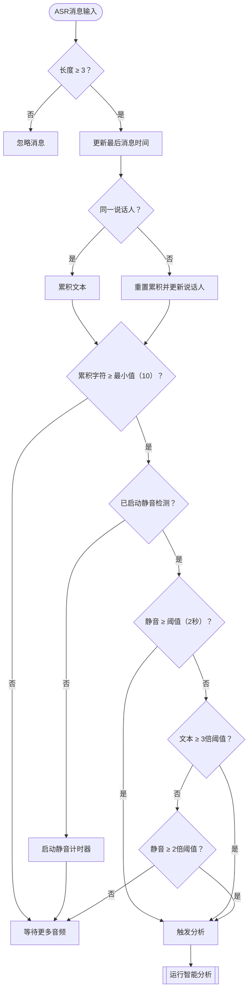
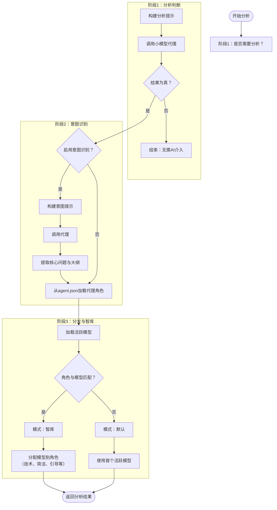
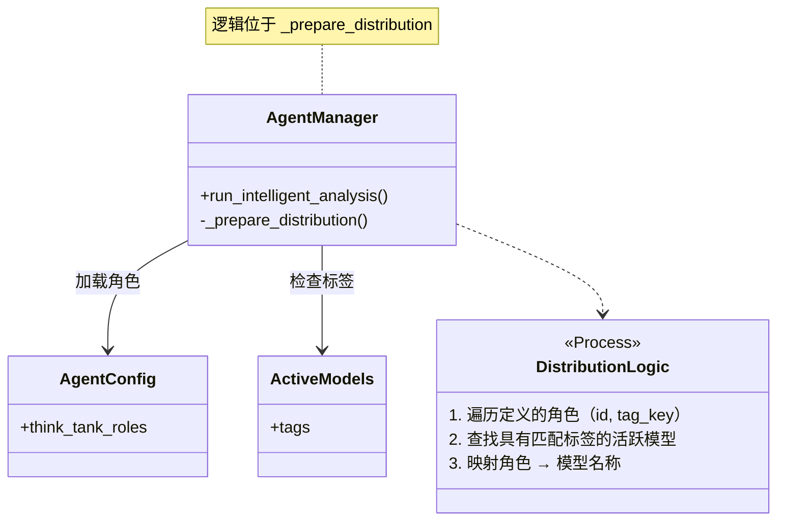
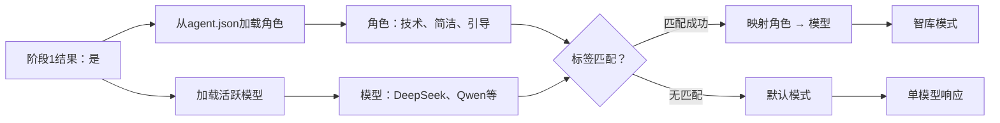

# 智能代理系统流程图

本文档基于代码库分析，可视化了智能分析、意图识别和智库分发的逻辑。

## 1. 整体系统触发流程（触发管理器）

该流程图展示了系统如何决定何时触发智能分析。

```mermaid
flowchart TD
    Start([ASR消息输入]) --> CheckLen{长度 ≥ 3？}
    CheckLen -- 否 --> Ignore[忽略消息]
    CheckLen -- 是 --> UpdateTime[更新最后消息时间]
    
    %% 应该为整个信息监控，而不是只监控同一说话人。 改为：信息 积累文本>10  启动静音监控
    UpdateTime --> SameSpeaker{同一说话人？}
    SameSpeaker -- 是 --> Accumulate[累积文本]
    SameSpeaker -- 否 --> NewSpeaker[重置累积并更新说话人] 
    
    Accumulate --> CheckThreshold{累积字符 ≥ 最小值（10）？}
    NewSpeaker --> CheckThreshold
    
    CheckThreshold -- 否 --> Wait[等待更多音频]
    CheckThreshold -- 是 --> StartSilence{已启动静音检测？}
    
    StartSilence -- 否 --> StartTimer[启动静音计时器]
    StartSilence -- 是 --> CheckSilence{静音 ≥ 阈值（2秒）？}
    
    StartTimer --> Wait
    CheckSilence -- 否 --> CheckForce{文本 ≥ 3倍阈值？}
    CheckSilence -- 是 --> Trigger[触发分析]
    
    CheckForce -- 是 --> Trigger
    CheckForce -- 否 --> CheckTimeout{静音 ≥ 2倍阈值？}
    
    CheckTimeout -- 是 --> Trigger
    CheckTimeout -- 否 --> Wait
    
    Trigger --> RunAnalysis[[运行智能分析]]
```

## 2. 智能分析与意图识别流程

该流程图详细说明了 `IntelligentAgent` 中的三阶段分析过程。

```mermaid
flowchart TD
    Start([开始分析]) --> Phase1[阶段1：是否需要分析？]
    
    subgraph P1 [阶段1：分析判断]
        BuildPrompt1[构建分析提示] --> CallLLM1[调用小模型代理]
        CallLLM1 --> Parse1{结果为真？}
        Parse1 -- 否 --> End[结束：无需AI介入]
    end
    
    Parse1 -- 是 --> CheckIntent{启用意图识别？}
    
    subgraph P2 [阶段2：意图识别]
        CheckIntent -- 是 --> BuildPrompt2[构建意图提示]
        BuildPrompt2 --> CallLLM2[调用代理]
        CallLLM2 --> Parse2[提取核心问题与大纲]
        Parse2 --> Phase3
    end
    
    CheckIntent -- 否 --> Phase3
    
    subgraph P3 [阶段3：分发与智库]
        Phase3[从agent.json加载代理角色] --> LoadConfig[加载活跃模型]
        LoadConfig --> Match{角色与模型匹配？}
        
        Match -- 是 --> ThinkTank[模式：智库]
        ThinkTank --> Assign[分配模型到角色\n（技术、简洁、引导等）]
        
        Match -- 否 --> Default[模式：默认]
        Default --> Single[使用首个活跃模型]
    end
    
    Assign --> Output([返回分析结果])
    Single --> Output
```

## 3. 智库逻辑细节

该图专门聚焦“智库”分发机制的工作方式。

```mermaid
classDiagram
    class AgentManager {
        +run_intelligent_analysis()
        -_prepare_distribution()
    }
    class AgentConfig {
        +think_tank_roles
    }
    class ActiveModels {
        +tags
    }
    
    AgentManager --> AgentConfig : 加载角色
    AgentManager --> ActiveModels : 检查标签
    
    note for AgentManager "逻辑位于 _prepare_distribution"
    
    class DistributionLogic {
        <<Process>>
        1. 遍历定义的角色（id, tag_key）
        2. 查找具有匹配标签的活跃模型
        3. 映射角色 → 模型名称
    }
    
    AgentManager ..> DistributionLogic
```

```mermaid
flowchart LR
    Input[阶段1结果：是] --> LoadRoles[从agent.json加载角色]
    LoadRoles --> Roles[角色：技术、简洁、引导]
    
    Input --> LoadModels[加载活跃模型]
    LoadModels --> Models[模型：DeepSeek、Qwen等]
    
    Roles --> MatchLogic{标签匹配？}
    Models --> MatchLogic
    
    MatchLogic -- 匹配成功 --> Map[映射角色 → 模型]
    Map --> Result[智库模式]
    
    MatchLogic -- 无匹配 --> Fallback[默认模式]
    Fallback --> Single[单模型响应]
```